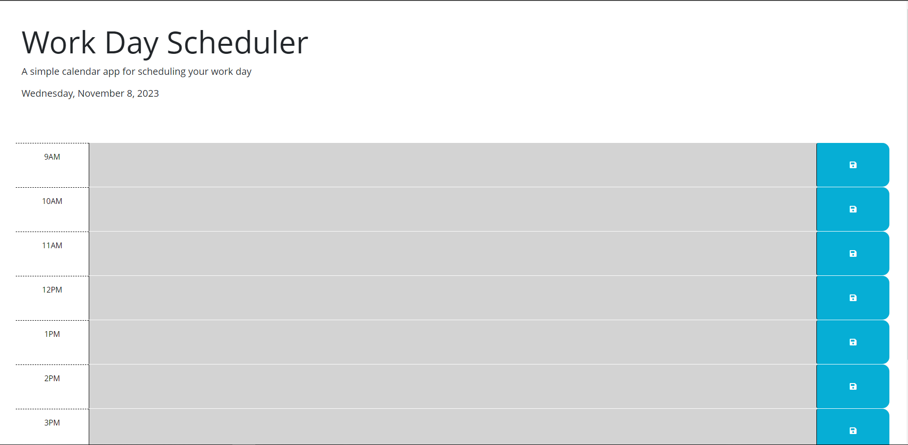

# Work Day Scheduler Starter Code

A simple and intuitive daily planner to help you schedule your work day efficiently. This web application allows you to create, save, and manage your tasks for standard business hours (9 AM to 5 PM). The interface dynamically updates the time blocks to indicate whether they are in the past, present, or future, providing a clear visual representation of your daily schedule.

Highlights of this website are 
Real-time Updates: Time blocks change colors in real-time, providing an accurate an schedule.
Persistent Data: Your tasks are saved in local storage, ensuring they persist even if you refresh the page.

